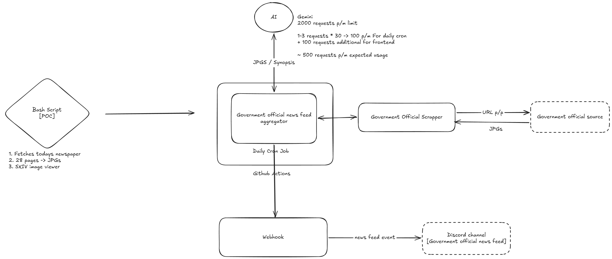

# Get news on your discord the oblique (~~pir~~-[official]) way

Oh there's a 3 hours power outage in your area? Let me check with BESCOM what's the cause.

Oh it's a scheduled outage for 9 HOURS? Why weren't we informed before hand?

Oh it's present in TIMES OF INDIA PAGE 4? Guess TOI is the government's official news channel right? Right? (No political discourse in the issues section please)

## Presenting news bot!

1. What does it do? Provide "Government official" news on your favourite discord channel / RSS feed / whatever.
2. How does it achieve this? Fetch "Government official" newspaper via public sector feed obviously because it's government official public information available for the public adhereing to the RTI guidelines of the constitution.
3. Whats the source of this "Government official" news? Maybe check with BESCOM, they'll provide the sources.
4. What if I have any more questions? I am not obligated to provide any more information unless I am ~~forced~~ instructured to do via a "High Court order"

## Documentation

### System Architecture

We're moving from Bash POC to a multithreaded - event based scheduler system, leveraging AI and webhooks to generate synopsis and provide updates on the latest government notifications. This ensures that users receive timely, summarized insights directly into their preferred communication channels without manual intervention.

1. Data Ingestion Layer: Scrapers and Consolidator pull raw data from official government News Channel and generate PDFs from source.
2. Processing Layer: An AI-driven engine processes the raw PDF content, extracting key insights and generating concise, human-readable synopses.
3. Notification Layer: Disseminates the summarized insights via webhooks to integrated communication platforms, ensuring stakeholders are updated in real-time.
4. Scheduled Execution: The workflow is orchestrated by GitHub Actions, ensuring consistent, automated updates based on the defined cron schedule. 
5. Manual trigger: Allows for on-demand execution of the workflow via the GitHub Actions interface, providing flexibility for ad-hoc updates or testing.

Footnote: The above paragraph is completely AI generated, and I take full responsibility for the buzzwords used to make this project sound significantly more enterprise-ready than it actually is. 

#### Diagram

